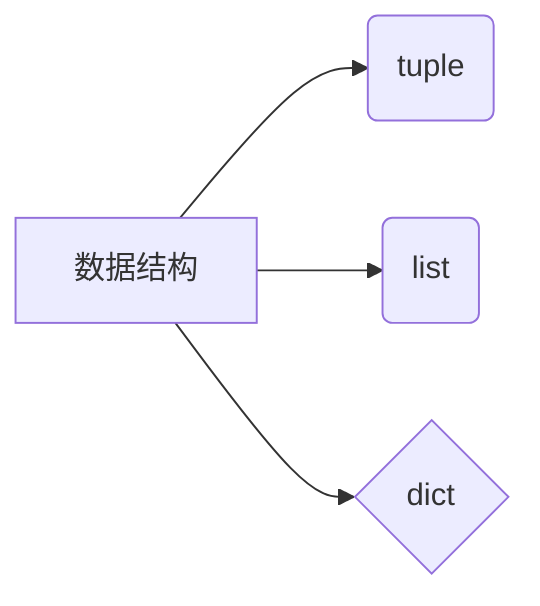

数据结构
--
定义：
**数据结构是计算机存储和组织数据的方式**



元组
--
```python
# 元素全是整数的元组
primeNumber = (2,3,5,7)

# 元素全是浮点数的元组
floatNumber = (1.5.1.6.1.7)
# 元素是字符串、整型、浮点数等等混合的元组
mixTuple = ("Max","1998",49.5)
```
# 元组索引
```python
calender = ("1月1日"，”1月2日“，”1月4日“)
print(calender[0])
print(calender[1])
```

# 元组查找
in是判断是不是在
```python
number = (1,2,3,4,5)
position = ("东","西","南","中","北")
print(2 in number)
print("中" in position)
```
元组是不可变的

列表
--
定义列表是可变的 ： 增加、删除、修改、查询

```python
players = ["小叮当"， "qian", "Tang", "Max","杰老板"，"飞飞"]
print(players[2])
print(players[5])
```

# 切片

```python
someLetters = ["a", "b","c","d","e"]
print(someLetters[1:3])
print(someLetters[1:])
```
## 追加元素

```python
# 定义列表list
fruit = ["apple","grap","cherry"]
# 在列表fruit中追加waitermenlon
fruit.append(waitermenlon)
# 使用print输出fruit列表
print(fruit)
```
## 插入元素

```python
# 定义列表集合
rank = ["max","jeremy","christina"]
# 用insert插入列表
rank.insert(1,"may")
print(rank)
```

字典
--
当我们存储的数据过多时，如何快速查找一个指定的数据就成了难题，要解决这样的问题，我们要学习新的数据类型 -- 字典

定义：
在python中，将两种数据关联在一起形成一个元素，由多个这样的元素组成的数据类型称为字典，又称为dict

字典中的元素是不考虑排列顺序的。

```python
products = {”口香糖“:15,"可乐":5.5,"薯片":45}
print(products)
```

## 字典元素查找

<!--stackedit_data:
eyJoaXN0b3J5IjpbLTE3NDE2NzYyODYsMTQ4OTUxMDMxNCwtMT
I4NTYyMjAyNiwxODIwMzQ2MjA1XX0=
-->