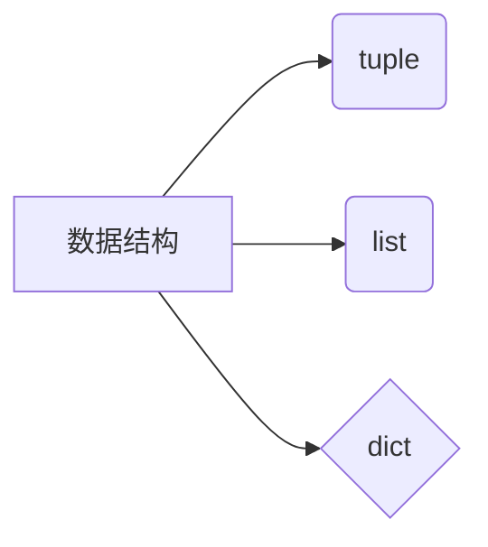

数据结构
--
定义：
**数据结构是计算机存储和组织数据的方式**



元组
--
```python
# 元素全是整数的元组
primeNumber = (2,3,5,7)

# 元素全是浮点数的元组
floatNumber = (1.5.1.6.1.7)
# 元素是字符串、整型、浮点数等等混合的元组
mixTuple = ("Max","1998",49.5)
```
# 元组索引
```python
calender = ("1月1日"，”1月2日“，”1月4日“)
print(calender[0])
print(calender[1])
```

# 元组查找
in是判断是不是在
```python
number = (1,2,3,4,5)
position = ("东","西","南","中","北")
print(2 in number)
print("中" in position)
```
元组是不可变的

列表
--
定义列表是可变的 ：
<!--stackedit_data:
eyJoaXN0b3J5IjpbMjA4NzkwMjgxMiwxODIwMzQ2MjA1XX0=
-->