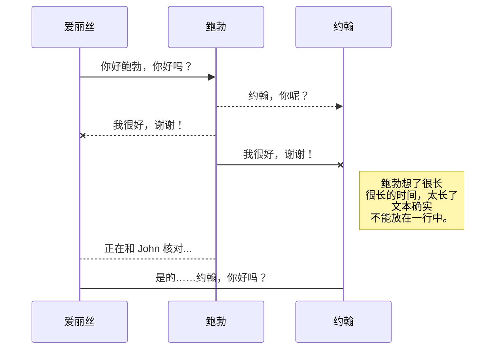

---
layout: _posts
title: "时间复杂度"
date:   2023-12-31
tags: [算法]
comments: true
author: kaxiu808  
--- 
**时间复杂度**
> 用来评估算法运行效率的一个式子


```python
 print('hello world')
```

```python
for i in range(n):
	print('hello world')
```

```python
for i in range(n):
	for j in range(n):
		print('hello world')
```

```python
for i in range(n):
	for j in range(n):
		for k in range(n):
			print('hello world')
```
O(1)  的意思就是   O 就是大约    1 就是单位



<!--stackedit_data:
eyJoaXN0b3J5IjpbLTU4NDUyOTcyMywtNTcxOTA0MDgzXX0=
-->